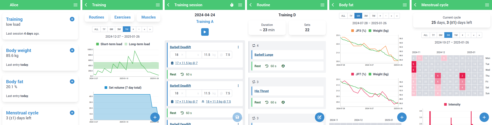

# Valens

[/ˈva.lens/ [ˈväːlɛns] *lat.* strong, vigorous, healthy](https://en.wiktionary.org/wiki/valens#Latin)



## Features

- Track your training progress
    - Define training routines
    - Choose from more than 150 exercises or create your own
    - Log repetitions, weight, time and rating of perceived exertion (RPE) for each set
    - Measure your training execution using a stopwatch, timer or metronome
    - Assess the progress for each routine and exercise
- Keep track of your body weight
- Calculate and log your body fat based on the 3-site or 7-site caliper method
- Monitor your menstrual cycle (if you have one 😉)

## Installation

The latest release can be installed from [PyPI](https://pypi.org/p/valens).

```
pip install valens
```

The latest development version can be installed from [TestPyPI](https://test.pypi.org/p/valens).

```
pip install --pre --index-url https://test.pypi.org/simple/ --extra-index-url https://pypi.org/simple/ valens
```

## Demo Mode

To get a first impression of Valens, the app can be run in demo mode.

```
valens demo
```

The app can be accessed on `http://127.0.0.1:5000/`. A temporary database with random example data is used. All changes are non-persistent. Adding `--public` to the command line makes the app available to other devices on your network.

## Configuration and Running

A configuration file must be created before running the app for the first time.

```
valens config
```

The environment variable `VALENS_CONFIG` must be set to the *absolute* path of the created config file.

### Local Network

The development server can be used to provide the app for your local computer or local network.

```
VALENS_CONFIG=$PWD/config.py valens run
```

By default, the app is only accessible on your local computer at `http://127.0.0.1:5000/`. If you trust the users in your network, you can make the server publicly available adding `--public` to the command line:

```
VALENS_CONFIG=$PWD/config.py valens run --public
```

### Public Network

The development server is not intended for production use. Please consider the [deployment options](https://flask.palletsprojects.com/en/2.3.x/deploying/) for providing the app in a public network.

#### Example Configuration: NGINX and uWSGI

The following configuration binds the app to `/valens`.

`/etc/uwsgi/valens.ini`

```ini
[uwsgi]
master = true
plugins = python
socket = /run/uwsgi/%n.sock
manage-script-name = true
mount = /valens=valens:app
uid = http
gid = http
env = VALENS_CONFIG=/opt/valens/config.py
```

`/etc/nginx/nginx.conf`

```nginx
[...]

http {

    [...]

    server {

        [...]

        gzip on;
        gzip_types text/plain test/css text/javascript application/json application/wasm;

        location = /valens { return 301 /valens/; }
        location /valens/ { try_files $uri @valens; }
        location @valens {
                include uwsgi_params;
                uwsgi_pass unix:/run/uwsgi/valens.sock;
        }

    }

}
```

NGINX compression is disabled by default.
With compression enabled, the amount of data transferred can be significantly reduced, resulting in a reduction in transfer time, especially on slow networks.

## Documentation

- [Development](doc/DEVELOPMENT.md)
- [Architecture](doc/ARCHITECTURE.md)

## License

This project is licensed under the terms of the [AGPL-3.0](LICENSE) license and includes [third-party software](THIRD-PARTY-LICENSES).
