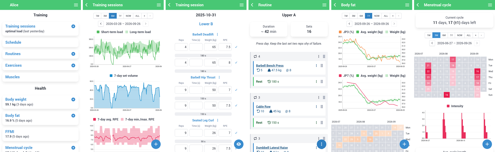

# Valens

[/ˈva.lens/ [ˈväːlɛns] *lat.* strong, vigorous, healthy](https://en.wiktionary.org/wiki/valens#Latin)

Plan your training, follow it and see what it does to your body. A web app you host yourself, for you and anyone you share it with.



## Features

- Define training routines
- Choose from more than 150 exercises or create your own
- Plan your training days
- Log repetitions, weight, time and rating of perceived exertion (RPE) for each set
- Measure your training execution using a stopwatch, timer or metronome
- Follow the current exercise and rest time in notifications
- Calculate a one-repetition maximum (1RM) or the weights of a drop set
- Assess the progress for each routine, exercise and muscle
- Keep track of your body weight
- Calculate and log your body fat based on the 3-site or 7-site caliper method
- Follow your fat-free mass index (FFMI)
- Monitor your menstrual cycle
- Install the app on your device and browse your data without a connection to the server
- Share the app with several users, each with their own data
- Protect accounts with passkeys, with one-time login links for recovery

Valens runs in current versions of Chromium-based browsers, Firefox and Safari.

## Installation

Valens is available as a Python package and as a container image. The package uses the Python installation of the machine it runs on, the container brings everything with it.

### Python Package

Valens requires Python 3.10 or newer. Install it into a virtual environment, as many distributions do not permit installing packages into the system Python. On Debian and Ubuntu, the `python3-venv` package is needed to create one.

```sh
python3 -m venv ~/.venvs/valens
source ~/.venvs/valens/bin/activate
```

The latest release can be installed from [PyPI](https://pypi.org/p/valens).

```sh
pip install valens
```

The latest development version can be installed from [TestPyPI](https://test.pypi.org/p/valens).

```sh
pip install --pre --index-url https://test.pypi.org/simple/ --extra-index-url https://pypi.org/simple/ valens
```

Activate the environment in every shell session that runs `valens`, or call the commands by their path, `~/.venvs/valens/bin/valens`.

### Container

The latest release is available as a container image on the [GitHub Container Registry](https://ghcr.io/treiher/valens) as `ghcr.io/treiher/valens:latest`. The latest development version is available under the `dev` tag as `ghcr.io/treiher/valens:dev`. The image is downloaded automatically when the container is started for the first time.

## Running

### Python Package

Demo mode runs without any setup. Regular use requires a config file, a user and a server.

#### Demo Mode

To get a first impression of Valens, the app can be run in demo mode.

```sh
valens demo
```

The app can be accessed on `http://localhost:5000/`. The names of the example users to sign in with are printed on startup. A temporary database with generated example data is used, containing training logs that cover every page of the app. All changes are non-persistent. Adding `--public` to the command line makes the app available to other devices on the network. It should only be used on a network you trust. A different port can be selected with `--port`.

#### Setup

A config file must be created before running the app for the first time.

```sh
valens config
```

By default, the config file is created in the current directory and the database at `~/.local/share/valens/valens.db`. A different directory for the config file can be selected with `-d`, a different path for the database with `--database`. The database file is created automatically when the app or a CLI command accesses it for the first time. The preset `PUBLIC_URL` must be changed if the app is reachable under a different URL, as described under [Public URL](#public-url).

The environment variable `VALENS_CONFIG` must be set to the *absolute* path of the config file. All following commands expect it to be set, in every shell session and in the definition of a service running the app.

```sh
export VALENS_CONFIG=$PWD/config.py
```

A user must be created before signing in for the first time. Users sign in by entering their name, unless username login is disabled. Only users with the admin role are able to manage users in the app.

```sh
valens user create <name> <female|male> --role admin
```

The biological sex is used for the body fat calculation, the optional body height (`--height`) for the FFMI.

Users can also be listed, updated and deleted on the command line. See `valens user --help` for all available commands.

#### Local Use (Development Server)

The development server can be used to provide the app for the local computer or local network.

```sh
valens run
```

By default, the app is only accessible on the local computer at `http://localhost:5000/`. Adding `--public` to the command line makes the app available to other devices on the network:

```sh
valens run --public
```

It should only be used on a network you trust. A different port can be selected with `--port`.

The development server serves plain HTTP only, so the app is subject to the limitations described under [Plain HTTP](#plain-http). It is not intended for use in a public network. See [Deployment](#deployment) for providing the app there.

### Container

The container image uses [Gunicorn](https://gunicorn.org/) and listens on port 8000. A volume mounted at `/app` provides persistent storage for the database and configuration.

#### Docker / Podman

```sh
mkdir -p ~/valens
podman run -d --name valens -p 8000:8000 -v ~/valens:/app:Z,U ghcr.io/treiher/valens:latest
```

The app can be accessed on `http://localhost:8000/`. The database and the config file are stored in `~/valens`.

The `Z` option of the volume relabels the directory for SELinux and can be omitted on systems without it. The `U` option adjusts the ownership of the directory to the user running the app in the container. When using Docker, replace `podman` with `docker`, omit `:Z,U` and make the directory writable for uid 1000.

A container created this way is not started again after a reboot. See [Systemd (Quadlet)](#systemd-quadlet) for starting it automatically. Continue with [First Start](#first-start).

#### Systemd (Quadlet)

The container can be managed as a systemd service using [Podman Quadlet](https://docs.podman.io/en/latest/markdown/podman-systemd.unit.5.html).

`/etc/containers/systemd/valens.container`

```ini
[Unit]
Description=Valens

[Container]
ContainerName=valens
Image=ghcr.io/treiher/valens:latest
PublishPort=8000:8000
Volume=/var/lib/valens:/app:Z,U
NoNewPrivileges=true
DropCapability=ALL

[Service]
Restart=on-failure

[Install]
WantedBy=multi-user.target
```

The app runs as an unprivileged user in the container and needs no capabilities. The volume options are described under [Docker / Podman](#docker--podman).

```sh
mkdir -p /var/lib/valens
systemctl daemon-reload
systemctl enable --now valens
```

#### First Start

A config file is created in the volume when the container is started for the first time. Its `PUBLIC_URL` must be changed as described under [Public URL](#public-url). For local use, this is the address of the published port.

```python
PUBLIC_URL = 'http://localhost:8000'
```

The container must be restarted afterwards.

```sh
podman restart valens
```

When the container is managed by Quadlet, use `systemctl restart valens` instead.

A user must be created before signing in for the first time. Users sign in by entering their name, unless username login is disabled. Only users with the admin role are able to manage users in the app.

```sh
podman exec valens valens user create <name> <female|male> --role admin
```

All other CLI commands are run in the container in the same way, for example `podman exec valens valens user login-link <name>`. A container managed by systemd requires root privileges for these commands.

See [Deployment](#deployment) for providing the app in a public network.

#### Gunicorn Settings

Gunicorn can be configured with the following environment variables:

- `GUNICORN_WORKERS`: Number of worker processes (default: `2`)
- `GUNICORN_THREADS`: Number of threads per worker process (default: `1`)
- `GUNICORN_TIMEOUT`: Time in seconds after which an unresponsive worker process is restarted (default: `120`)

## Configuration

Valens is configured by a Python file. It is read when the server starts, so the server must be restarted after a change.

### Public URL

`PUBLIC_URL` must be set to the URL under which the app is reachable by its users (e.g. `https://valens.example.com`), otherwise passkeys and one-time login links do not work. Passkeys additionally require HTTPS, unless the app is accessed via `localhost`. Behind a reverse proxy, it is the URL of the proxy, not the address of the server behind it.

The config file presets `PUBLIC_URL` to `http://localhost:5000`, which matches the port of the development server. As the container listens on port 8000, the preset must be adapted for it even if the app is only used locally.

With `PUBLIC_URL` set and the app served over HTTPS or accessed via `localhost`, users add a passkey to their account under Profile in the menu.

### Additional Settings

- `PERMANENT_SESSION_LIFETIME`: How long a user stays signed in, counted from the sign-in and not from the last request, so an active user is signed out at the deadline as well (default: `timedelta(weeks=52)`).
- `USERNAME_LOGIN_ENABLED`: Whether signing in by entering a username without any credential is possible (default: `True`). If set to `False`, users sign in with a passkey and `PUBLIC_URL` must be set. The initial sign-in and the recovery of an account without a passkey is done via a one-time login link created by an admin in the app or with `valens user login-link <name>` on the command line.

### Database

The database file holds the data of all users and is the only file that needs to be backed up to preserve them. It is located at `~/.local/share/valens/valens.db` by default, or in the mounted volume when using the container. Copy the file while the server is stopped, or use `sqlite3 valens.db ".backup backup.db"` for a consistent copy of a database in use. In a rootless container, the files belong to a subordinate user ID and are reached with `podman unshare`.

The config file holds the secret key that signs the session cookies. Losing it signs out all users, but no data is lost.

## Deployment

A production-grade server should be used for providing the app in a public network. See the [deployment options](https://flask.palletsprojects.com/en/stable/deploying/) for the alternatives. The Python package requires a config file and a user as described under [Setup](#setup), created as shown below. `PUBLIC_URL` must be set as described under [Public URL](#public-url).

Serving the app over HTTPS is recommended. It is required for passkeys and for installing the app on a device, as described under [Plain HTTP](#plain-http). The examples below show only the parts specific to Valens. TLS is configured in the surrounding `server` block.

### Python Package

One option for an installation of the Python package is using NGINX and uWSGI. The package must be importable by uWSGI, which is achieved by installing it into a dedicated virtual environment.

```sh
python3 -m venv /opt/valens/venv
/opt/valens/venv/bin/pip install valens
```

The service user needs to read the config file and write the database. Both must be located outside the web root, as files below it are served directly.

```sh
mkdir -p /var/lib/valens
chown http:http /var/lib/valens
/opt/valens/venv/bin/valens config -d /var/lib/valens --database /var/lib/valens/valens.db
chown root:http /var/lib/valens/config.py
chmod 640 /var/lib/valens/config.py
```

This replaces the `valens config` command of the [Setup](#setup). The other CLI commands must be run as the service user, so that the files they create stay accessible to it.

```sh
sudo -u http env VALENS_CONFIG=/var/lib/valens/config.py /opt/valens/venv/bin/valens user create <name> <female|male> --role admin
```

`/etc/uwsgi/valens.ini`

```ini
[uwsgi]
master = true
plugins = python
socket = /run/uwsgi/%n.sock
manage-script-name = true
mount = /=valens:app
uid = http
gid = http
virtualenv = /opt/valens/venv
env = VALENS_CONFIG=/var/lib/valens/config.py
```

`/etc/nginx/nginx.conf`

```nginx
[...]

http {

    [...]

    server {

        [...]

        gzip on;
        gzip_types text/plain text/css text/javascript application/json application/wasm;

        location / { try_files $uri @valens; }
        location @valens {
            include uwsgi_params;
            uwsgi_pass unix:/run/uwsgi/valens.sock;
        }

    }

}
```

### Container

A reverse proxy such as NGINX can be used to expose the container in a public network.

`/etc/nginx/nginx.conf`

```nginx
[...]

http {

    [...]

    server {

        [...]

        gzip on;
        gzip_types text/plain text/css text/javascript application/json application/wasm;

        location / {
            proxy_pass http://127.0.0.1:8000;
        }

    }

}
```

### NGINX Compression

Compression is disabled in NGINX by default and is enabled by the `gzip` directives in the examples above. With compression enabled, the amount of data transferred can be significantly reduced, resulting in a reduction in transfer time, especially on slow networks. [Brotli](https://github.com/google/ngx_brotli) offers better compression ratios than gzip and is supported as an optional NGINX module.

## Upgrading

The database schema is upgraded automatically when the app is used for the first time after an update. A copy of the database is created next to it beforehand, named after the revision it is upgraded from and the time of the upgrade. The schema can also be upgraded explicitly, so that the upgrade does not happen during the first use of the app.

### Python Package

Install the new version in the activated virtual environment and restart the server.

```sh
pip install --upgrade valens
```

The schema is upgraded explicitly with `valens upgrade`.

For a deployment as described under [Deployment](#deployment), use the `pip` and `valens` commands of its virtual environment and run the latter as the service user.

### Container

Pull the new image, remove the container and create it again with the command that was used before.

```sh
podman pull ghcr.io/treiher/valens:latest
podman stop valens
podman rm valens
podman run -d --name valens -p 8000:8000 -v ~/valens:/app:Z,U ghcr.io/treiher/valens:latest
```

When the container is managed by Quadlet, restarting the service recreates it.

```sh
systemctl restart valens
```

The schema is upgraded explicitly with `podman exec valens valens upgrade`.

## Limitations

### Offline Use

Recording data requires a connection to the server. Every change is sent there first, and a change made while it is unreachable is reported as an error instead of being stored for later.

### Plain HTTP

Browsers withhold a number of features from pages that are not served over HTTPS. Valens is usable over plain HTTP, but the following are not:

- Installing the app on the device and starting it without a connection, which need a service worker
- Signing in with a passkey, unless the app is accessed via `localhost`
- Notifications outside the app, which are shown by the service worker
- Copying a routine or a login link to the clipboard
- Keeping the screen on while a timer is running

Serving the app over HTTPS enables all of them.

### Background Use

The beeps of the timer and the metronome are produced in the browser, and notifications are triggered by the app while it runs. With the screen turned off or Valens in the background, they can be late, distorted or absent, depending on how aggressively the browser suspends a page that is not visible.

## Documentation

- [Development](doc/DEVELOPMENT.md)
- [Architecture](doc/ARCHITECTURE.md)
- [Conventions](doc/CONVENTIONS.md)

## License

This project is licensed under the terms of the [AGPL-3.0](LICENSE) license and includes [third-party software](THIRD-PARTY-LICENSES).
