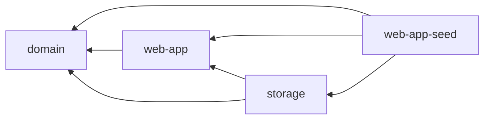

# Architecture

Valens is a web application built using the __Hexagonal Architecture__ pattern with a __Rust-based frontend__ compiled to WebAssembly and a __Python-based backend__.

## Frontend ([`crates/`](../crates))

Rust-based progressive web application (PWA) compiled to WebAssembly.

### [`domain`](../crates/domain)

Core business logic and interfaces.

- Defines entities and services
- Specifies the storage interfaces (ports)
- Is completely independent of the rest of the web app
- Has no hard dependencies on other crates except for essential functionality
- Provides no serialization of entities
- Is fully covered by tests

### [`storage`](../crates/storage)

Storage adapters.

- Handles data storage on the server and in the browser (IndexedDB, Web Storage)
- Implements repositories defined in `domain` and `web-app`

### [`web-app`](../crates/web-app)

Framework-agnostic UI logic.

- Provides logic reusable across different frontend frameworks
- Uses business logic provided by `domain`

### [`web-app-seed`](../crates/web-app-seed)

Framework-specific UI logic using Seed.

- Defines the entry point of the web application
- Implements rendering, event handling and routing
- Integrates `domain`, `web-app` and `storage`

### Dependencies

## Backend ([`valens/`](../valens))

Python-based server application.

- Provides a REST API using Flask
- Stores data in a SQLite database
- Enables WSGI-compatible deployment

## Architectural Principles

Valens follows the Hexagonal Architecture pattern.

- Domain logic is isolated from external concerns (UI, storage, network).
- Adapters implement interfaces (ports) to interact with the core logic.
- Components are modular and independently testable.
