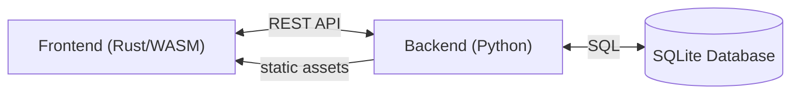
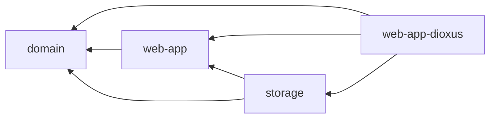

# Architecture

Valens is a web application built using the __Hexagonal Architecture__ pattern with a __Rust-based frontend__ compiled to WebAssembly and a __Python-based backend__.

```mermaid
 graph LR
     FE["Frontend (Rust/WASM)"]
     BE["Backend (Python)"]
     DB[(SQLite Database)]
     FE <--> |"REST API"| BE
     BE <--> |"SQL"| DB
     BE -- "static assets" --> FE
```

## Frontend ([`crates/`](../crates))

Rust-based progressive web application (PWA) compiled to WebAssembly.

### [`domain`](../crates/domain)

Core business logic and interfaces.

- Defines entities and services
- Specifies the storage interfaces (ports)
- Is completely independent of the rest of the web app
- Has no hard dependencies on other crates except for essential functionality
- Provides no serialization of entities
- Is fully covered by tests

### [`storage`](../crates/storage)

Storage adapters.

- Handles data storage on the server and in the browser (IndexedDB, Web Storage)
- Implements repositories defined in `domain` and `web-app`

### [`web-app`](../crates/web-app)

Framework-agnostic UI logic.

- Provides logic reusable across different frontend frameworks
- Uses business logic provided by `domain`

### [`web-app-dioxus`](../crates/web-app-dioxus)

Framework-specific UI logic using Dioxus.

- Defines the entry point of the web application
- Implements rendering, event handling and routing
- Integrates `domain`, `web-app` and `storage`

### Dependencies

```mermaid
graph RL
    WAD[web-app-dioxus]
    WA[web-app]
    S[storage]
    D[domain]
    WAD --> D & S & WA
    WA --> D
    S --> D & WA
```

### Data flow

The application is local-first. The REST backend is the authoritative store, the browser keeps a local copy, and the UI renders from an in-memory cache.

- **REST backend** (authoritative): the source of truth for all user data. Mutations are sent here first, so they require a connection.
- **Local database** (`IndexedDB`): an offline-capable copy of the user's entities. Entity reads are served from here, so the app works offline. It is populated by synchronization and updated on mutations, and is never written to directly by the UI.
- **In-memory cache**: the single source of truth for rendering. Components never fetch data themselves; they read from the cache and ask it to reload the affected entities after a mutation, which loads them from the local database.
- **Synchronization**: pulls remote changes into the local database and then refreshes the cache.

The storage layer serves entity reads from the local database and sends mutations to the backend before applying them locally (see [`cached_rest.rs`](../crates/storage/src/cached_rest.rs)). User accounts and the server version are read directly from the backend and are not cached locally.

### Application state

Application state lives in two kinds of holders.

- **Global singletons**: app-wide state that exists independently of any session, such as the service entry points, a connectivity flag, and a change counter that components use to trigger reloads.
- **Session context**: per-session reactive state provided at the session root and consumed by components, such as the cache, the synchronization state, the current session, and the ongoing training session.

Two service facades own different concerns.

- **Domain service** (over the cached REST storage): training entities such as exercises, routines, training sessions, body weight, body fat, and period, as well as users and the session.
- **Web-app service** (over local browser storage): application concerns that are not domain entities, namely settings, the in-app log, and the ongoing training session.

The in-app log is captured by a custom logger that records every log entry into a buffer backed by browser storage, in addition to the browser console. This is the log that the notification and component-logging mechanisms write to.

### Error handling

Failures are surfaced through three mechanisms, chosen by audience.

- **Notifications**: failures of user-initiated actions. They appear below the navigation bar and are mirrored to the log. The severity (warning or error) follows whether the underlying domain error is recoverable.
- **Component logging**: domain errors that surface in a component, such as a failed cache read, rather than a notification. They are logged only, at debug when the error is recoverable and at error otherwise.
- **Direct logging**: everything else, such as platform and JavaScript interop failures, parsing fallbacks, and silent background work that has no recoverable domain error and is not surfaced to the user.

## Backend ([`valens/`](../valens))

Python-based server application.

- Provides a REST API using Flask
- Stores data in a SQLite database
- Enables WSGI-compatible deployment

## Architectural Principles

Valens follows the Hexagonal Architecture pattern.

- Domain logic is isolated from external concerns (UI, storage, network).
- Adapters implement interfaces (ports) to interact with the core logic.
- Components are modular and independently testable.
